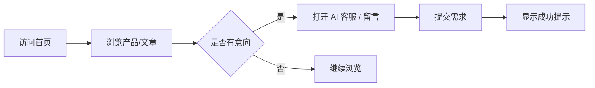
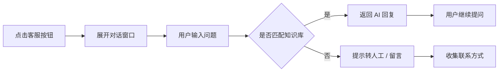
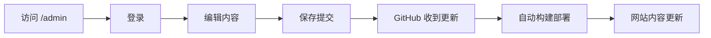

# 华威制造有限公司官网产品需求文档

## 1. 产品概述

华威制造有限公司官网是一个面向饲料机械行业的展示型企业网站，旨在向潜在客户展示公司的核心产品（预混料机组、饲料混合设备、饲料除尘设备、锤片粉碎机等）、企业实力与联系方式，并通过新闻资讯模块提升搜索引擎和 AI 检索的可见性。网站采用静态构建方式部署，并集成 Decap CMS 内容管理后台，使非技术人员也能在网页后台中更新文字、图片、产品信息和文章。网站可部署到免费海外托管平台，无需域名与备案即可上线。

- 主要目标：建立专业可信的线上企业形象，获取潜在客户咨询。
- 目标用户：饲料厂、养殖场、畜牧企业、饲料设备经销商及行业采购人员。
- 管理员用户：公司运营人员，通过 `/admin` 后台管理网站内容。

## 2. 核心功能

### 2.1 用户角色

| 角色 | 访问方式 | 核心权限 |
|------|----------|----------|
| 访客 | 直接访问 | 浏览页面、查看产品、阅读文章、使用客服、提交留言 |
| 管理员 | 访问 `/admin` 并登录 | 修改公司信息、管理产品、发布/编辑文章、上传图片、修改首页内容 |

### 2.2 功能模块

1. **首页**：品牌主视觉、公司简介、核心产品展示、核心优势、最新文章、页脚联系信息。
2. **关于我们**：企业发展历程、工厂实力、资质荣誉、企业文化。
3. **产品中心**：四大类产品列表（预混料机组、饲料混合设备、饲料除尘设备、锤片粉碎机），每个产品含详情介绍与技术参数。
4. **新闻资讯**：文章列表与文章详情，用于 SEO 与 AI 收录。
5. **联系我们**：联系方式、地图占位、在线留言表单。
6. **AI + 人工客服**：悬浮在页面右下角的智能客服入口，支持常见问题自动回复与转人工提示。
7. **CMS 后台**：通过 `/admin` 进入，支持可视化编辑公司信息、产品、文章和首页内容。

### 2.3 页面详情

| 页面名称 | 模块名称 | 功能描述 |
|----------|----------|----------|
| 首页 | Hero 主视觉 | 大图背景 + 企业 slogan + 行动按钮，滚动进入视口时淡入 |
| 首页 | 核心产品 | 四类产品卡片，hover 放大并显示“查看详情”按钮 |
| 首页 | 核心优势 | 数字统计 + 图标说明，增强信任感 |
| 首页 | 最新文章 | 展示最近 3 篇新闻文章，点击进入详情 |
| 关于我们 | 企业介绍 | 文字 + 工厂/设备图片 |
| 关于我们 | 发展历程 | 时间轴形式展示 |
| 关于我们 | 资质荣誉 | 证书/荣誉图标墙 |
| 产品中心 | 产品列表 | 按类别筛选，产品卡片网格布局 |
| 产品中心 | 产品详情 | 大图、参数表、应用场景、咨询按钮 |
| 新闻资讯 | 文章列表 | 分类筛选、卡片列表 |
| 新闻资讯 | 文章详情 | 富文本内容、发布时间、返回按钮 |
| 联系我们 | 联系信息 | 电话、邮箱、地址、地图占位 |
| 联系我们 | 留言表单 | 姓名、电话、需求描述，前端校验与提交提示 |
| 全局 | AI 客服浮窗 | 右下角悬浮按钮，点击展开对话窗口 |
| 全局 | 导航与页脚 | 响应式顶部导航、页脚链接与备案占位 |
| 后台 | CMS 登录页 | 管理员通过 GitHub 或邮箱登录 |
| 后台 | 内容编辑 | 表单化编辑公司信息、产品、文章、首页内容 |
| 后台 | 图片上传 | 上传并自动保存图片到仓库 |

## 3. 核心流程

### 3.1 访客浏览流程

访客进入首页 → 浏览 Hero 与核心产品 → 点击产品进入产品详情 → 产生兴趣后点击“立即咨询” → 唤起 AI 客服或填写留言表单 → 信息提交成功提示。

### 3.2 AI 客服对话流程

用户点击客服按钮 → 展开对话窗口 → 输入问题 → AI 根据关键词匹配知识库回复 → 若用户要求人工或 AI 无法回答，提示留下联系方式转人工。

### 3.3 管理员发布内容流程

管理员访问 `/admin` → 登录 → 选择要编辑的内容（公司信息 / 产品 / 文章 / 首页） → 在表单中修改或新增 → 保存 → 内容提交到 GitHub → 触发自动构建与重新部署 → 网站内容更新。

## 4. 用户界面设计

### 4.1 设计风格

- **整体风格**：工业力量感 + 现代科技风，稳重、专业、可信。
- **主色调**：深海蓝 `#0f172a` 作为主色，传递可靠与工业感；亮橙 `#f97316` 作为强调色，传递能量与关注。
- **辅助色**：石板灰 `#64748b` 用于正文，浅灰 `#f1f5f9` 用于背景分隔。
- **字体**：标题使用具有力量感的无衬线字体，正文使用清晰易读的无衬线字体。
- **按钮风格**：直角或微圆角，主按钮使用橙色渐变，悬停时加深并上移。
- **布局风格**：桌面端优先，宽屏 Hero + 网格产品卡片 + 清晰的信息层级；移动端自动适配为单列。
- **图标风格**：线性工业图标，使用 Lucide React 图标库。

### 4.2 页面设计概述

| 页面名称 | 模块名称 | UI 元素 |
|----------|----------|---------|
| 首页 | Hero | 全屏背景图、半透明遮罩、大标题、副标题、双 CTA 按钮、向下滚动提示 |
| 首页 | 核心产品 | 四列网格卡片、产品图标、标题、简介、hover 阴影与放大 |
| 首页 | 核心优势 | 数字计数动画、图标 + 标题 + 描述 |
| 首页 | 最新文章 | 三列卡片、封面图、标题、摘要、日期 |
| 关于我们 | 企业介绍 | 左文右图、段落标题、高亮数据 |
| 关于我们 | 发展历程 | 垂直时间轴、年份节点、事件描述 |
| 关于我们 | 资质荣誉 | 四列图标卡片 |
| 产品中心 | 产品列表 | 顶部分类标签、产品卡片网格 |
| 产品中心 | 产品详情 | 大图、参数表格、应用场景、底部 CTA |
| 新闻资讯 | 文章列表 | 卡片列表、侧边栏分类 |
| 新闻资讯 | 文章详情 | 标题、元信息、正文、返回按钮 |
| 联系我们 | 联系信息 | 三列信息卡片、地图占位图 |
| 联系我们 | 留言表单 | 输入框、文本域、提交按钮、成功提示 |
| 全局 | AI 客服 | 右下角圆形悬浮按钮、对话气泡窗口、消息列表、输入框 |
| 后台 | CMS 登录 | 简洁的登录面板 |
| 后台 | CMS 编辑器 | 左侧内容集合列表，右侧表单编辑器，支持图片上传与富文本 |

### 4.3 响应式策略

- **桌面端优先**：最大宽度 1280px 居中，使用多列网格展示产品与文章。
- **平板端（768px-1024px）**：产品网格变为两列，导航折叠为汉堡菜单。
- **移动端（<768px）**：单列布局，Hero 标题缩小，客服窗口全屏展开，时间轴改为左侧单一垂直线。
- **CMS 后台**：主要针对桌面端使用，移动端仅做基础适配。

### 4.4 动画与交互

- 页面滚动进入视口时，内容块执行淡入 + 上移动画（使用 IntersectionObserver 或 CSS 动画）。
- 产品卡片 hover 时轻微放大并显示阴影。
- 数字统计区域进入视口时执行数字递增动画。
- AI 客服窗口展开/收起使用平滑过渡动画。
- 表单提交后显示加载状态与成功提示。
- CMS 编辑器保存后显示提交状态提示。
