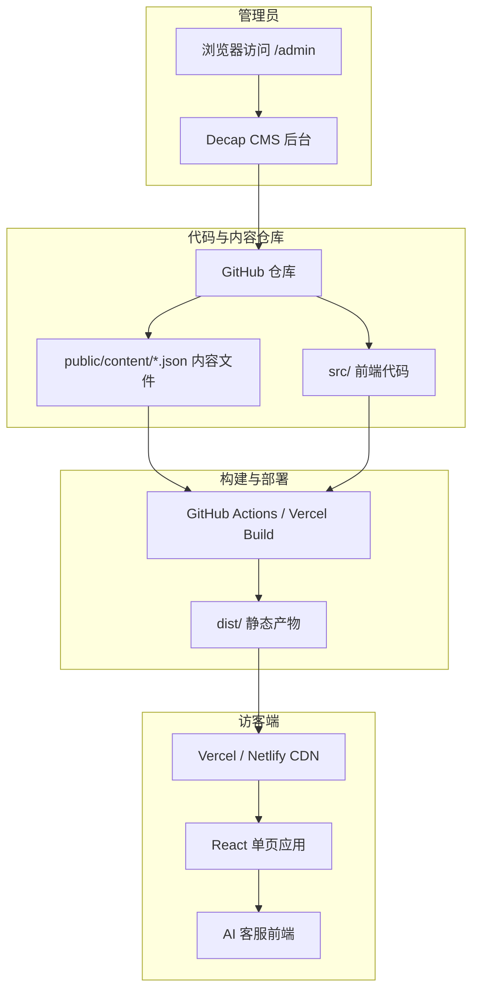

# 华威制造有限公司官网技术架构文档

## 1. 架构设计

本项目为基于 React + TypeScript + Vite + Tailwind CSS 的静态网站，内容通过 Decap CMS 进行管理。网站数据（公司信息、产品、文章、首页配置）存储在 `public/content/` 目录下的 JSON 文件中，前端通过 `fetch` 动态加载。Decap CMS 通过 Git Gateway 或 GitHub 认证直接编辑仓库中的 JSON 文件，保存后触发 GitHub Actions 自动构建并部署到 Vercel/Netlify，无需独立后端服务器或数据库。



## 2. 技术描述

- **前端框架**：React 18 + TypeScript
- **构建工具**：Vite
- **初始化工具**：vite-init
- **项目模板**：react-ts
- **样式方案**：Tailwind CSS 3
- **路由方案**：React Router DOM
- **图标库**：Lucide React
- **状态管理**：Zustand（用于 AI 客服会话状态）
- **CMS 方案**：Decap CMS（原 Netlify CMS），通过 Git Gateway 或 GitHub 认证
- **内容存储**：`public/content/` 目录下的 JSON 文件
- **内容加载**：前端通过 `fetch('/content/xxx.json')` 动态加载
- **构建产物**：静态 HTML/CSS/JS + JSON 数据文件，部署后无需 Node.js 运行环境
- **SEO 方案**：
  - 每个页面设置 `<title>` 和 `<meta name="description">`
  - 使用语义化 HTML 标签（header、nav、main、section、article、footer）
  - 生成 `sitemap.xml` 与 `robots.txt`
  - 添加 JSON-LD 结构化数据（Organization、Product、Article）

## 3. 路由定义

| 路由 | 用途 |
|------|------|
| `/` | 首页 |
| `/about` | 关于我们 |
| `/products` | 产品中心列表 |
| `/products/:slug` | 产品详情页 |
| `/news` | 新闻资讯列表 |
| `/news/:slug` | 文章详情页 |
| `/contact` | 联系我们 |
| `/admin` | Decap CMS 后台管理 |
| `/admin/*` | CMS 内部路由 |

## 4. 数据模型

### 4.1 产品数据

```typescript
interface Product {
  id: string;
  slug: string;
  name: string;
  category: 'premix' | 'mixing' | 'dust' | 'crusher';
  categoryName: string;
  summary: string;
  description: string;
  image: string;
  parameters: { label: string; value: string }[];
  features: string[];
  application: string;
}
```

### 4.2 文章数据

```typescript
interface Article {
  id: string;
  slug: string;
  title: string;
  summary: string;
  content: string;
  cover?: string;
  category: string;
  publishedAt: string;
  tags: string[];
}
```

### 4.3 公司信息

```typescript
interface CompanyInfo {
  name: string;
  slogan: string;
  description: string;
  phone: string;
  email: string;
  address: string;
  foundedYear: number;
  values: { title: string; desc: string }[];
  milestones: { year: string; title: string; desc: string }[];
  honors: { title: string; desc: string }[];
  stats: { value: number; suffix: string; label: string }[];
}
```

### 4.4 首页配置

```typescript
interface HomeConfig {
  heroTitle: string;
  heroSubtitle: string;
  heroBackground: string;
  ctaPrimary: string;
  ctaSecondary: string;
}
```

### 4.5 AI 客服会话

```typescript
interface ChatMessage {
  role: 'user' | 'ai';
  content: string;
  timestamp: number;
}

interface ChatState {
  isOpen: boolean;
  messages: ChatMessage[];
  toggle: () => void;
  addMessage: (message: ChatMessage) => void;
}
```

## 5. 内容文件结构

```
public/
  admin/
    index.html          # Decap CMS 入口
    config.yml          # CMS 集合与字段配置
  content/
    company.json        # 公司信息
    home.json           # 首页配置
    products.json       # 产品列表
    articles.json       # 文章列表
    chat-knowledge.json # AI 客服知识库
  sitemap.xml
  robots.txt
```

## 6. 组件结构

```
src/
  components/
    Layout.tsx          # 页面整体布局（导航 + 页脚）
    Navbar.tsx          # 响应式顶部导航
    Footer.tsx          # 页脚
    Hero.tsx            # 首页主视觉
    ProductCard.tsx     # 产品卡片
    ArticleCard.tsx     # 文章卡片
    ChatWidget.tsx      # AI 客服悬浮窗
    ScrollReveal.tsx    # 滚动显示动画包装组件
    SectionTitle.tsx    # 统一章节标题
    Loading.tsx         # 数据加载占位
  pages/
    Home.tsx            # 首页
    About.tsx           # 关于我们
    Products.tsx        # 产品列表
    ProductDetail.tsx   # 产品详情
    News.tsx            # 新闻列表
    ArticleDetail.tsx   # 文章详情
    Contact.tsx         # 联系我们
  data/
    chatKnowledge.ts    # AI 客服知识库（前端内置）
  hooks/
    useScrollReveal.ts  # 滚动动画 hook
    useContent.ts       # 通用内容加载 hook
  store/
    chatStore.ts        # Zustand 客服状态
  services/
    contentApi.ts       # 内容 JSON 加载封装
  App.tsx               # 路由配置
  main.tsx              # 入口
```

## 7. CMS 配置说明

### 7.1 Decap CMS 集成

- 在 `public/admin/index.html` 中引入 Decap CMS 脚本。
- 在 `public/admin/config.yml` 中定义集合（Collections）和字段。
- 配置后端为 `git-gateway`，通过 Netlify Identity 或 Decap CMS 提供的 Git Gateway 服务进行身份认证。
- 管理员登录后，可直接在 `/admin` 中编辑 JSON 内容文件并上传图片。

### 7.2 内容集合

| 集合名称 | 对应文件 | 可编辑内容 |
|----------|----------|------------|
| 公司信息 | `public/content/company.json` | 名称、电话、邮箱、地址、简介、价值观、荣誉、里程碑 |
| 首页配置 | `public/content/home.json` | 主标题、副标题、背景图、按钮文字 |
| 产品管理 | `public/content/products.json` | 添加/编辑产品、上传图片、修改参数 |
| 文章管理 | `public/content/articles.json` | 发布文章、上传封面、编辑正文 |
| 客服知识库 | `public/content/chat-knowledge.json` | 常见问题与回复 |

## 8. AI 客服实现方案

### 8.1 当前阶段（无后端、无 API Key）

- 前端内置知识库，根据用户输入关键词匹配常见问题。
- 命中关键词时返回预设回答；未命中时提供转人工提示并引导用户留言。
- 对话数据仅存于前端状态，页面刷新后清空。

### 8.2 未来扩展（用户拥有 AI API 后）

- 在 `src/services/aiService.ts` 中封装 AI 请求方法。
- 支持 Kimi、豆包、OpenAI 等兼容 OpenAI 接口格式的模型。
- 通过环境变量注入 API Key，请求代理可配置为后端服务或边缘函数，避免前端暴露密钥。

## 9. 部署方案

### 9.1 开发环境

- `npm run dev` 本地预览。
- `npm run build` 构建产物到 `dist/` 目录。

### 9.2 生产部署

1. 将代码推送到 GitHub 仓库。
2. 在 Vercel 或 Netlify 中导入 GitHub 仓库。
3. 配置构建命令为 `npm run build`，输出目录为 `dist`。
4. 启用 Git Gateway 或 GitHub OAuth，供 Decap CMS 认证使用。
5. 保存 CMS 内容后，自动触发重新构建与部署。

### 9.3 域名与备案

- 当前阶段可使用 Vercel/Netlify 提供的免费二级域名，无需域名和备案。
- 后续若使用国内服务器或国内 CDN，需完成 ICP 备案。
